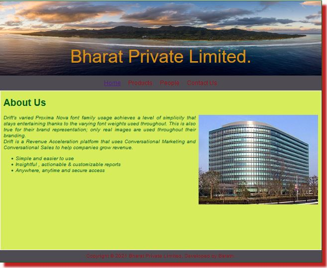
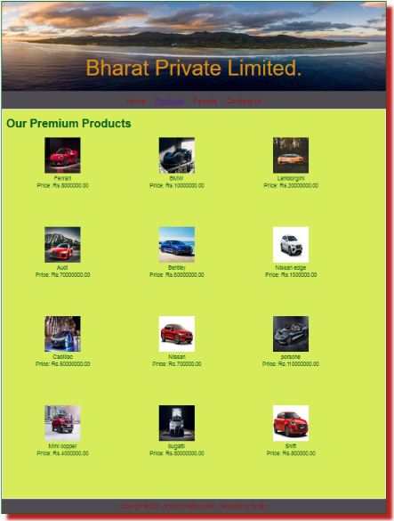
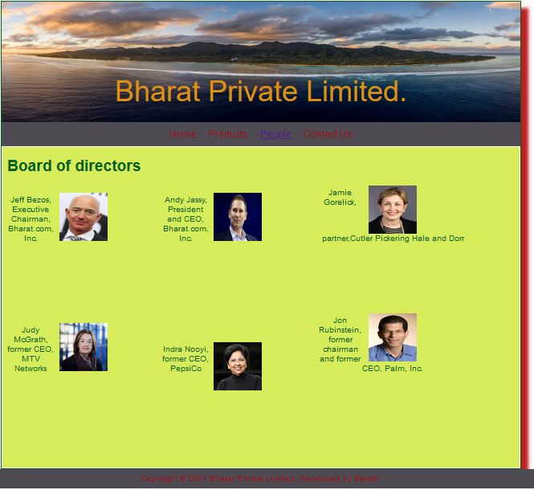
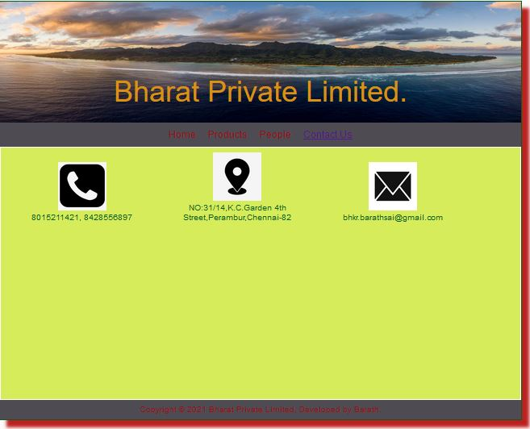

# Web Design for a Software Product Company

## AIM:

To design a static website for a software product company company.

## DESIGN STEPS:

### Step 1:

Requirement collection.

### Step 2:

Creating the layout using HTML and CSS.

### Step 3:

Updating the sample content.

### Step 4:

Choose the appropriate style and color scheme.

### Step 5:

Validate the layout in various browsers.

### Step 6:

Validate the HTML code.

### Step 6:

Publish the website in the given URL.

## PROGRAM :

Home code:
<!DOCTYPE html>
<html lang="en">
  <head>
    <title>Bharat Private Limited</title>
    <link rel="stylesheet" href="./css/layout.css" />
    <link rel="icon" href="./img/icon.png" type="image/x-icon" />
  </head>

  <body>
    

      
Bharat Private Limited.

      

        
<a href="/static/home.html">Home</a>

        
<a href="/static/products.html">Products</a>

        
<a href="/static/people.html">People</a>

        
<a href="/static/contact us.html">Contact Us</a>

      

      

        

          <h1>About Us</h1>
          
            

                 Drift's varied Proxima Nova font family usage achieves a level of
              simplicity that stays entertaining thanks to the varying font weights
              used throughout. This is also true for their brand representation; 
              only real images are used throughout their branding. 
             
                 Drift is a Revenue Acceleration platform that uses Conversational
              Marketing and Conversational Sales to help companies grow revenue.
            <ul>
              <li>Simple and easier to use</li>
              <li>Insightful , actionable & customizable reports</li>
              <li>Anywhere, anytime and secure access</li>
            </ul>
          

        

      

      

        Copyright &#169; 2021 Bharat Private Limited, Developed by Barath.
      

    

  </body>
</html>

Product code:
<!DOCTYPE html>
<html lang="en">
  <head>
    <title>Bharat Private Limited</title>
    <link rel="stylesheet" href="./css/layout.css" />
    <link rel="icon" href="./img/icon.png" type="image/x-icon" />
  </head>

  <body>
    

      
Bharat Private Limited.

      

        
<a href="/static/home.html">Home</a>

        
<a href="/static/products.html">Products</a>

        
<a href="/static/people.html">People</a>

        
<a href="/static/contact us.html">Contact Us</a>

      

      

        
    
          <h1>Our Premium Products</h1>
          

              
 
                  

                  
                  

                  
Ferrari

                  
Price: Rs.8000000.00 

              

              
 
                  

                  
                  

                  
Lamborgini

                  
Price: Rs.10000000.00 

              

          

          
        
      

      

        Copyright &#169; 2021 Bharat Private Limited, Developed by Barath.
      

    

  </body>
</html>

People code:
<!DOCTYPE html>
<html lang="en">
  <head>
    <title>Bharat Private Limited</title>
    <link rel="stylesheet" href="./css/layout.css" />
    <link rel="icon" href="./img/icon.png" type="image/x-icon" />
  </head>

  <body>
    

      
Bharat Private Limited.

      

        
<a href="/static/home.html">Home</a>

        
<a href="/static/products.html">Products</a>

        
<a href="/static/people.html">People</a>

        
<a href="/static/contact us.html">Contact Us</a>

      

      

        

          <h1>Board of directors</h1>
            
 
                

                
                

                
Jeff Bezos, Executive Chairman, Bharat.com, Inc.

            

            
 
                

                
                

                
 Andy Jassy, President and CEO, Bharat.com, Inc.
     
            

            
 
                

                
                

                
Jamie Gorelick, partner,Cutler Pickering Hale and Dorr

            

            
 
                

                
                

                
Judy McGrath, former CEO, MTV Networks

            

            
 
                

                
                

                
Indra Nooyi, former CEO, PepsiCo

            

            
 
                

                
                

                
Jon Rubinstein, former chairman and former CEO, Palm, Inc.

            
 
          

          

       

       

          Copyright &#169; 2021 Bharat Private Limited, Developed by Barath.
       

     

   </body>
 </html>

Contact us code:
<!DOCTYPE html>
<html lang="en">
  <head>
    <title>Bharat Private Limited</title>
    <link rel="stylesheet" href="./css/layout.css" />
    <link rel="icon" href="./img/icon.png" type="image/x-icon" />
  </head>

  <body>
    

      
Bharat Private Limited.

      

        
<a href="/static/home.html">Home</a>

        
<a href="/static/products.html">Products</a>

        
<a href="/static/people.html">People</a>

        
<a href="/static/contact us.html">Contact Us</a>

      

      

        
    
          

              
 
                  

                  
                  

                  
8015211421,
                                        8428556897   
                  

              

              
 
                  

                  
                  

                  
NO:31/14,K.C.Garden 4th Street,Perambur,Chennai-82

              

              
 
                

                
                

                
bhkr.barathsai@gmail.com

            

          

          
        
      

      

        Copyright &#169; 2021 Bharat Private Limited, Developed by Barath.
      

    

  </body>
</html>

## OUTPUT:

### Home code:

### Product code:

### People code:

### Contact us code:

## Result:

Thus a website is designed for the software product company and the HTML,CSS code are validated.
